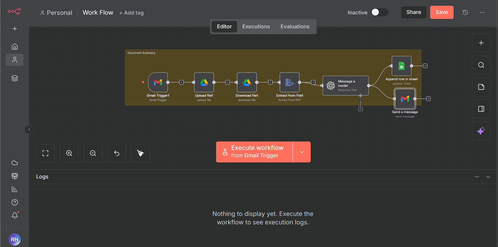

# Automated Legal Document Summary Workflow (n8n)

Research-driven automation system that ingests legal documents from email, extracts structured insights using LLMs, and distributes results via Google Sheets and email.

---

## 🔍 Overview
This project implements an **end-to-end document intelligence pipeline** using **n8n**.  
It automatically processes incoming legal documents (complaints, contracts, filings), extracts concise summaries and key legal risk points using an LLM, and stores the results for operational tracking and downstream analysis.

The workflow is designed to be:
- reproducible
- auditable
- production-oriented
- easily extensible

---

## ⚙️ Workflow Diagram
<p align="center">
  
</p>

---

## 🧠 Workflow Logic (Step-by-Step)

1. **Gmail Trigger**
   - Monitors inbox for emails with attachments  
   - Filters messages using legal document keywords (e.g., Complaint, Contract)

2. **Google Drive Upload**
   - Stores incoming documents in a structured Drive folder  
   - Ensures traceability and centralized storage

3. **Document Download**
   - Retrieves the stored file for processing

4. **PDF Text Extraction**
   - Extracts raw text from legal PDF documents

5. **LLM Processing (OpenAI via n8n)**
   - Produces:
     - a concise ~200-word factual summary
     - top five legal issues / risk points
     - a computed procedural deadline
     - a strictly validated JSON output (schema-enforced)

6. **Google Sheets Logging**
   - Appends structured outputs to a tracking sheet  
   - Enables auditing, review, and analytics

7. **Email Notification**
   - Sends an internal summary email with key findings

---

## 📦 Output Schema (LLM)

The workflow enforces a **strict JSON schema** to guarantee predictable downstream automation:

```json
{
  "RawID": "string",
  "DateReceived": "YYYY-MM-DD",
  "Summary": "string",
  "KeyIssues": ["Issue1", "Issue2", "Issue3", "Issue4", "Issue5"],
  "Deadline": "YYYY-MM-DD",
  "DeadlineAssumption": "string",
  "EmailSubject": "string",
  "SummaryEmail": "HTML string"
}
